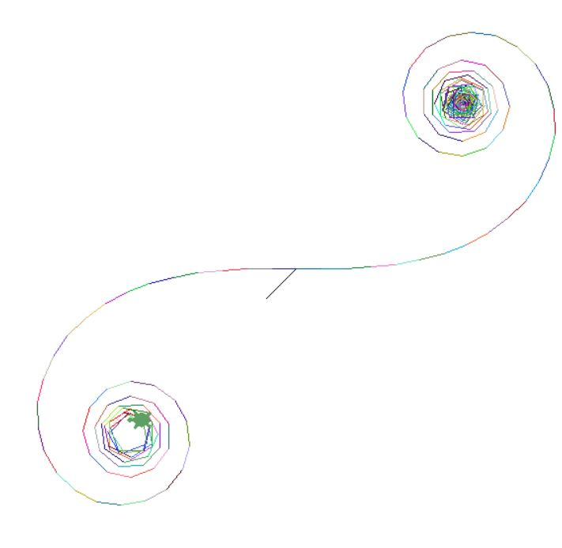

# Dumbness--
A weird programing language made in python

# Instant code using the interpreter
Instant code will be ran when the ENTER button is pressed,</br>
math equations can be entered,
```
dumb > 1+1
2
```
# Running a code file
To run a code file, use whatever file extension you want,
run the file using ```run(filepath)```
# Hello World
the print function prints
```pycon
print("Hello World")
```
# Variables
vars are made using the `var` keyword
```pycon
var number = 4
print(number)
```
# Comments
comments are only one-lined and created using th `#` keyword
```pycon
# This is a comment
```
# Functions
functions are defined using the `fun` keyword and their code is started with a `->` as diffrent from `:` in python and `{` and other languages
```pycon
code:
fun why() -> print("why")
why()
output:
why
```
function params are used the same way as in python:
```pycon
code:
fun egg(text) -> print("egg " + text)
egg("yolk")
output:
egg yolk
```
# Loops
loops are used with either `for <varriable> = <starting value> to <limit> do <code> enddo` or `while <expression> do <code> enddo`
## For loop
```pycon
code :
for i = 0 to 3 do
print("EGG YOLK")
enddo

output :
EGG YOLK
EGG YOLK
EGG YOLK
```
## While Loop
```pycon
code :
var i = 0
while i < 3 do
var i = i + 1
print(i)
enddo

output :
0
1
2
```

# Input
input is handled by using either `input` for strings, `input_int` for ints, or `input_float` for floats.
```pycon
code :
var text = input("Enter your text here : ")
var full_num = input_int("Enter a full number here : ")
var decimal_num = input_float("Enter a decimal number here : ")
print(text)
print(full_num)
print(decimal_num)

output : 
Enter your text here : yeello
Enter a full number here : 1
Enter a decimal number here : 3.123
yeello
1
3.123
0
```
# Turtle
The turtle library won't need to be imported, and instead will be used with the next commands:
```
Create Screen           : createScreen(<screen name>)
Create Turtle           : createTurtle()
Set Turtle Shape        : turtle_set_shape(<shape>)
Set Turtle Speed        : turtle_set_shape("<speed>")
Set Turtle Position     : turtle_set_pos("<x>","<y>") 
Turtle Forward          : turtle_forward("<amount>")
Turtle Bakcwards        : turtle_backwards("<amount>")
Turtle Right Turn       : turtle_right("<amount>")
Turtle Left Turn        : turtle_left("<amount>")
Turtle Set Random Color : turtle_set_random_color()
Turtle Set Color Mode   : turtle_set_colormode("<cmode>")
Turtle Main Loop        : turtle_mainLoop()
```
example : 
```pycon
createScreen("title")
createTurtle()
var i = 0
turtle_set_shape("turtle")
turtle_set_speed("3000")
turtle_set_pos("30","30")
while true do
    var i = i + 1
    turtle_forward("25")
    turtle_left(i)
    turtle_set_random_color()
enddo
```
result : 
